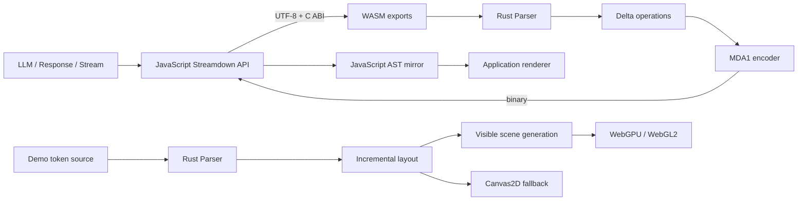
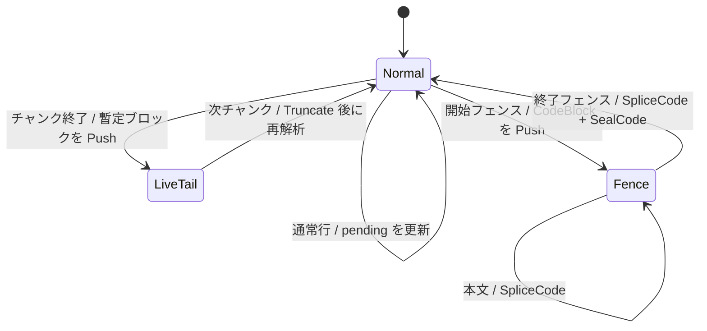

# Streamdown 設計書

## 1. 概要

Streamdown は、LLM が生成する Markdown をチャンク単位で受け取り、レンダラー非依存の AST とその差分を返す追記最適化パーサーである。コアは依存ライブラリを持たない Rust クレートとして実装し、同じ処理をネイティブ Rust と WebAssembly（WASM）から利用できる。

通常の Markdown ブロックは未確定な文書末尾だけを再解析し、フェンスコードは現在行の末尾だけを差し替える。この構成により、入力全体をチャンクごとに再解析・再転送せず、長いストリームや巨大なコードブロックでも差分量を限定する。

リポジトリには次の2つの成果物がある。

- `streamdown`: Markdown の逐次解析、AST、差分生成、MDA1 バイナリ符号化を担うライブラリ
- `streamdown-web`: コア AST を単一 Canvas に描画するデモ。WebGPU、WebGL2、Canvas2D を順に利用する

## 2. 設計目標と対象外

### 設計目標

- LLM のトークンストリームを低遅延で逐次解析する
- チャンク境界に依存せず、まとめて入力した場合と同じ AST を得る
- 描画層へ渡す変更を文書全体ではなく小さな差分にする
- Rust とブラウザの間で JSON シリアライズを使用しない
- パーサーを HTML や特定 UI から独立させる
- 巨大文書でもデモの描画量をビューポート周辺に限定する

### 対象外

- CommonMark の完全実装
- HTML および生 HTML の解釈
- ネストしたリスト、脚注などの複雑な文書構造
- AST 内でのスタイル、レイアウト、DOM ノードの保持
- 任意位置の増分編集。基本モデルは末尾追記であり、全文置換はリセット後の再解析として扱う

## 3. 全体構成



ライブラリ利用時は、Rust が返した `Delta` を MDA1 に符号化し、JavaScript が復号して自身の `document` に適用する。デモでは Rust クレートを直接リンクしているため MDA1 を経由せず、`Parser` と `Delta` をそのままレイアウト更新へ利用する。

## 4. ディレクトリと責務

| パス | 責務 |
|---|---|
| `src/parser.rs` | AST 型、差分型、逐次パーサー、ブロック解析 |
| `src/inline.rs` | 強調、コード、リンク、数式、改行などの1パスインライン解析 |
| `src/binary.rs` | `Delta` を MDA1 形式へ符号化 |
| `src/lib.rs` | 公開 Rust API と WASM 向け C ABI |
| `js/streamdown.js` | MDA1 復号、AST ミラー、ストリーム入力を含む JavaScript API |
| `FORMAT.md` | MDA1 のワイヤ形式 |
| `tests/wasm.mjs` | Rust → WASM → MDA1 → JavaScript の結合テスト |
| `benches/stream.rs` | 通常ストリームとオープンコードフェンスの性能測定 |
| `webapp/src/main.rs` | GPU デモの起動、状態管理、増分レイアウト、シーン構築、操作 |
| `webapp/src/canvas2d.rs` | Canvas2D フォールバック |
| `webapp/src/code.rs` | 割り当てを抑えたコード字句解析とハイライト |
| `webapp/src/languages.rs` | 言語別キーワード、型、宣言、字句機能の定義 |
| `webapp/src/font.rs` | 埋め込みフォントのグリフラスタライズとキャッシュ |
| `webapp/src/math.rs` | RaTeX による数式組版、PNG/RGBA 化、キャッシュ |
| `webapp/src/search.rs` | 大文字小文字を区別しない前方一致 Trie |
| `webapp/src/shader.wgsl` | 矩形インスタンスの位置変換と描画 |
| `webapp/index.html` | Canvas、アクセシブルなテキスト版、検索・操作 UI |

## 5. コアデータモデル

### 5.1 AST

文書はトップレベルの `Vec<Block>` として保持する。ブロックは次の8種類である。

| `Block` | 主な内容 |
|---|---|
| `Paragraph` | インライン列 |
| `Heading` | レベル 1〜6 とインライン列 |
| `CodeBlock` | 言語、本文、フェンスが閉じたかどうか |
| `BlockQuote` | インライン列 |
| `UnorderedList` | 項目ごとのインライン列 |
| `OrderedList` | 開始番号と項目列 |
| `ThematicBreak` | 水平線 |
| `Table` | ヘッダーセルと行・セル |

インラインは `Text`、`Emphasis`、`Strong`、`Code`、`Math`、`Link`、`SoftBreak`、`HardBreak` の8種類である。AST は表示情報を持たず、レンダラーが自由にレイアウトできる。 LLM 拡張の `@[kind:id]` と `[[cite:source|label]]` は新しい AST variant を増やさず `Link` の `llm:` destination へ正規化し、`:::llm ...` は `CodeBlock.language = "llm:..."` として表現する。

### 5.2 差分操作

`Parser::append` は変更後の全文ではなく `Delta { ops }` を返す。

| `Op` | 意味 |
|---|---|
| `Truncate { from }` | `from` 以降のトップレベルブロックを削除 |
| `Push(block)` | 文書末尾へブロックを追加 |
| `SpliceCode { block, truncate_bytes, append }` | 指定コードブロックの UTF-8 末尾をバイト数で削り、文字列を追加 |
| `SealCode { block }` | オープンなコードブロックを確定済みに変更 |
| `AppendText { block, append }` | 単一 `Text` だけを持つ生成中段落へ UTF-8 を追記 |

操作は格納順に適用する。通常の未確定末尾は `Truncate` と `Push` で置換する。ただし構文記号を含まない単一テキスト段落は `AppendText` で既出 prefix を再解析せず追記する。コードフェンス内では `SpliceCode` によって現在の未確定行だけを更新する。

### 5.3 パーサー状態

`Parser` の主要状態は次の通りである。

| フィールド | 役割 |
|---|---|
| `blocks` | 現在の確定済み・未確定 AST |
| `mode` | 通常解析またはフェンスコード解析 |
| `line` | 改行がまだ到着していない通常行 |
| `pending` | 同種の複数行ブロック候補 |
| `pending_kind` | 段落、引用、順序なし／ありリストの分類 |
| `committed` | 次回も保持できる確定ブロック数 |
| `has_live` | AST 末尾に暫定ブロックが公開済みか |
| `live_plain` | 暫定末尾が `AppendText` 可能な単一プレーン段落か |

守るべき不変条件は以下である。

- `blocks[..committed]` は次の通常チャンクでも再解析しない
- `has_live` が真の場合、`blocks[committed..]` は次の追記前に破棄して再構築する
- フェンスモードの `block` はオープンな `CodeBlock` を指す
- `SpliceCode.truncate_bytes` は UTF-8 コードポイント境界に一致する
- `Delta` を順番に適用した外部 AST は常に `Parser::blocks()` と一致する

## 6. 逐次解析

### 6.1 通常ブロック

通常モードでは、入力から改行までを `line` に蓄積する。完全な行を受け取ると、空行、水平線、見出し、フェンス開始、または継続可能なブロックへ分類する。

段落、引用、リストは同じ種類の連続行を `pending` に保持する。空行や異なる種類の行が境界になり、ブロックを確定する。チャンク末尾に未完の内容がある場合は暫定ブロックを AST に公開する。次の `append` ではその暫定部分だけを `Truncate` し、蓄積済みのソースと新しい入力から作り直す。



見出しと水平線は1行で確定し、確定境界を進める。パイプテーブルは通常段落候補の先頭2行がヘッダーと区切り行の形式を満たした場合に `Table` へ変換する。

### 6.2 フェンスコード

バッククォートまたはチルダが3文字以上連続するとフェンスを開始する。開始時の文字種と長さを保持し、それ以上の同一記号だけで構成された行を終了フェンスとして認識する。

コード本文では、前回の未確定行の開始位置 `line_start` から末尾までを更新対象にする。新しいチャンクを内部本文へ追加した後、古い未確定末尾を削るバイト数と、新しい確定行・未確定行を合わせた文字列を `SpliceCode` として返す。差分サイズはコードブロック全体ではなく、おおむね新しいチャンクと現在行の長さに比例する。

`finish()` はストリーム終了を通知する。末尾改行なしの終了フェンスを認識して `SealCode` を返し、通常ブロックの暫定状態は以後再解釈しない確定状態にする。閉じていないコードフェンス自体はオープンのまま保持する。

### 6.3 インライン解析

インライン解析は左から右への1パスで行い、通常文字列を一時バッファへまとめる。エスケープ、数式、改行、コード、太字、強調、リンクの順に開始条件を確認し、閉じ区切りが見つかる場合だけ対応 AST を生成する。

不正または未完の区切りではバックトラックせず、通常テキストとして残す。強調やリンクラベルの内部だけ再帰解析する。これは CommonMark の厳密な区切り規則より、ストリーム中の予測可能な計算量を優先した設計である。

## 7. Rust・WASM・JavaScript 境界

### 7.1 Rust API

`Parser` の主な公開操作は次の通りである。

- `new()` / `default()`: 空の文書を作成
- `append(&str) -> Delta`: UTF-8 文字列を追記
- `finish() -> Delta`: 最終チャンクを確定
- `reset() -> Delta`: 状態を空にし、必要なら `Truncate(0)` を返す
- `replace(&str) -> Delta`: リセットと再解析を1つの差分にまとめる
- `blocks() -> &[Block]`: 現在の AST を参照
- `is_empty()`: 文書が空か確認
- `encode_delta(&Delta) -> Vec<u8>`: MDA1 へ符号化

### 7.2 WASM C ABI

`src/lib.rs` は `wasm32` のときだけ以下をエクスポートする。

| 関数 | 責務 |
|---|---|
| `md_create` / `md_destroy` | `Parser` と出力バッファを持つハンドルの生成・破棄 |
| `md_alloc` / `md_free` | JavaScript が UTF-8 入力を書き込む領域の確保・解放 |
| `md_append` | 入力検証、追記、MDA1 出力生成 |
| `md_reset` / `md_finish` | 状態変更と MDA1 出力生成 |
| `md_delta_ptr` / `md_delta_len` | ハンドル内の最新出力バッファを公開 |

入力用 `Vec<u8>` はスレッドローカルな一覧で所有し、`md_free` までアドレスを安定させる。出力はハンドルが保持し、次のパーサー呼び出しで再利用される。このため JavaScript 側は復号前に出力バイト列をコピーする。

### 7.3 MDA1

MDA1 はリトルエンディアンの独自形式である。先頭に ASCII `MDA1` と操作数を置き、その後にタグ付き操作と AST を並べる。整数は `u32`、文字列は UTF-8 バイト長と本体で表現する。詳細なタグとフィールド順は [FORMAT.md](FORMAT.md) を正とする。

JSON と比べて、中間オブジェクトの生成、キー文字列、文字列化・解析を避けられる。形式にはバージョン識別子としてマジック値があるが、後方互換の交渉機構はない。タグやフィールド順を変更する場合は Rust エンコーダー、JavaScript デコーダー、`FORMAT.md`、結合テストを同時に更新する必要がある。

### 7.4 JavaScript API

`Streamdown.load` が WASM をインスタンス化し、インスタンスごとに1つの Rust ハンドルと JavaScript AST 配列 `document` を持つ。

`append` は文字列を UTF-8 化して WASM メモリへコピーし、MDA1 を復号し、`applyDelta` で `document` をインプレース更新する。`consume` は `Response`、`ReadableStream`、Async Iterable、Iterable を統一的に扱い、バイナリチャンクでは `TextDecoder` のストリーミングモードによって分割された UTF-8 文字を復元する。`AbortSignal`、差分コールバック、終了時の自動 `finish` に対応する。

補助 API は AST のスナップショット、プレーンテキスト化、コードブロック・リンク抽出を JavaScript 側で提供する。`dispose` 後は Rust ハンドルを利用できず、AST も空になる。

## 8. Canvas デモ

### 8.1 起動とバックエンド選択

`webapp/src/main.rs` の `start` が非同期初期化を開始する。`renderer` URL パラメーターがなければ WebGPU を試し、失敗時は WebGL2、さらに失敗時は Canvas2D へフォールバックする。`renderer=webgpu|webgl|canvas2d` で初期バックエンドを指定できる。

WebGPU と WebGL2 は `wgpu` の同じ `App`、AST、レイアウト、シーン生成、WGSL シェーダーを共有する。Canvas2D は別の描画状態を持つが、同じ `streamdown::Parser`、コードハイライト、数式、検索、操作モデルを利用する。

### 8.2 フレーム処理

デモ入力は選択した Markdown 文書を空白境界でトークン化したモックである。各 `requestAnimationFrame` で経過時間と TPS から送信可能数を計算し、最大 `MAX_TOKENS_PER_FRAME` までを1チャンクにまとめて `Parser::append` へ渡す。

GPU 系のフレーム処理は以下の順で進む。

1. 検索クエリと検索インデックスを同期する
2. トークンクレジットに応じて入力を追記する
3. `Delta` の最小変更ブロックからレイアウトを再計算する
4. Canvas サイズとスクロール目標を更新する
5. 必要な場合だけ可視シーンを再構築する
6. インスタンスバッファと View uniform を更新して描画する

`BlockLayout` は各ブロックの絶対 Y 座標、高さ、生成時刻を保持する。`Delta` の操作から最初に変わったブロックを求め、その位置以降だけを再レイアウトする。生成時刻はストリーミング時のフェード表示に使う。

### 8.3 ビューポート仮想化

AST と全ブロックの軽量なレイアウト情報は保持するが、GPU の矩形インスタンスは現在のビューポート上下 160 px の範囲だけ生成する。スクロール中は View uniform で既存シーンを移動し、112 px 以上移動してオーバースキャンを消費したときにシーンを再構築する。

非常に長い文書では絶対座標をそのまま `f32` へ変換せず、現在のスクロール位置をシーン原点として座標を小さく保つ。これにより大きな Y 座標での精度低下を避ける。長大なコードブロックも、シーン生成時に可視行周辺だけを矩形へ変換する。

### 8.4 GPU シーン

描画プリミティブは `RectInstance` に統一する。背景、罫線、選択範囲、検索結果、スクロールバーだけでなく、ラスタライズ済みグリフと数式の coverage も同色・同アルファの水平矩形ランへ変換する。

WGSL シェーダーはインスタンスを triangle strip として展開し、View uniform の通常スクロールと数式用水平スクロールを適用する。フラグによって固定 UI、数式、ピクセルスナップ、線分描画を切り替える。描画パイプラインはアルファブレンドを使用する。

### 8.5 テキスト、コード、数式

- 本文は埋め込み Noto Sans CJK JP、コードは Noto Sans Mono を優先し、未収録文字は CJK フォント、さらに U+FFFD へフォールバックする
- `ab_glyph` で生成したグリフ coverage を文字・スケール・等幅指定ごとに最大 4,096 件キャッシュする
- コードは `Scanner` と `ParseStack` により、トークン列を保持せずコールバックへ範囲と `TokenKind` を渡す
- 言語差は `LanguageProfile` にエイリアス、キーワード、組み込み型、宣言、コメントや文字列などの字句機能をまとめる
- 数式は RaTeX で parse → layout → display list → 2倍解像度 PNG と進み、premultiplied alpha で縮小して RGBA の水平ランへ変換する
- 数式画像は式、表示形式、量子化したスケールをキーに最大 256 件キャッシュする

### 8.6 操作とアクセシビリティ

Canvas 上でスクロール、最下部への自動追従、スクロールバー操作、文字単位・単語単位・ブロック単位の選択、コピー、フォントサイズ変更、検索結果移動を扱う。表示数式は Shift + ホイールで横スクロールできる。

`index.html` は Canvas だけに情報を閉じず、元 Markdown のテキスト版、スキップリンク、キーボード操作、ARIA ラベル、ライブ通知を提供する。HTML 側の操作 UI と Rust 側の状態は Canvas の `data-*` 属性と合成キーボードイベントを介して同期する。

## 9. 検索設計

検索は大文字小文字を区別しない前方一致 Trie を使う。単語そのものに加えて先頭から最大64文字分の各文字サフィックスを登録するため、単語途中からの部分一致を前方一致として検索できる。各 Trie ノードはその prefix に一致する位置一覧を持ち、検索計算量は概ね `O(クエリ長 + 結果数)` となる。

GPU 版は位置を `{ block, character offset }` で保持し、AST の差分到着後に検索インデックスを dirty にする。連続ストリーム中の再構築を抑えるため、検索中でも再索引には時間間隔を設ける。Canvas2D 版は選択用プレーンテキストのバイト位置を使う。

## 10. 性能上の判断

| 課題 | 対応 |
|---|---|
| 通常末尾がチャンクごとに変化する | 確定 prefix を保持し、暫定 suffix のみ `Truncate + Push` |
| 巨大なオープンコードブロック | 現在行だけ `SpliceCode` で置換 |
| WASM 境界のコスト | JSON ではなく MDA1、出力はハンドルのバッファを再利用 |
| 高 TPS での呼び出し過多 | 1フレーム内のトークンを1チャンクへバッチ化 |
| 長大文書の描画量 | ビューポート周辺のみシーン化 |
| スクロール時のシーン再構築 | オーバースキャンと uniform 移動 |
| グリフ・数式生成コスト | サイズ量子化したメモリキャッシュ |
| WebGL の矩形数と更新頻度 | coverage の量子化とシーン更新の約33 msスロットリング |
| 巨大座標の `f32` 精度 | スクロール位置を局所的なシーン原点にする |

通常ブロックでは未確定 suffix のソースを再解析するため、空行なしで極端に長い段落が成長し続ける場合、その段落長に応じた再解析コストは残る。フェンスコードにはこの問題を避ける専用差分経路がある。

## 11. エラーとライフサイクル

- WASM ABI は null ハンドル、非ゼロ長入力に対する null ポインター、不正 UTF-8 を失敗として返す
- JavaScript デコーダーはマジック、未知タグ、余剰バイト、UTF-8 境界に合わない splice を例外にする
- `consume` は HTTP エラー、不正なチャンク型、キャンセルを呼び出し側へ伝播する
- C ABI を直接使う場合は `md_free` と `md_destroy` が必要である。JavaScript ラッパーは通常の戻り経路で入力を自動解放し、`dispose` でパーサーハンドルを破棄する
- 現状の `Streamdown.append` は `md_append` が WASM trap を起こさず戻ることを前提に、その直後で入力を解放する。trap 時の解放を保証する `try/finally` は使用していない
- デモでは Rust panic をブラウザ console へ転送し、GPU 初期化失敗は下位バックエンドへフォールバックする

## 12. ビルドとテスト

### コア

```sh
cargo test --release
rustup target add wasm32-unknown-unknown
./scripts/build_wasm.sh
npm test
```

`npm test` は事前に生成された `target/wasm32-unknown-unknown/release/streamdown.wasm` を使用する。

### Canvas デモ

```sh
./webapp/build.sh
cargo test --manifest-path webapp/Cargo.toml
python3 -m http.server 8080 --directory webapp
```

テストの責務は次のように分かれる。

- `src/parser.rs` の単体テスト: チャンク分割不変性、差分による AST 復元、コードフェンス、数式、表、改行、reset/replace/finish
- `tests/wasm.mjs`: WASM ABI、MDA1、JavaScript API、UTF-8 分割、キャンセル、破棄
- `webapp/tests/*.rs`: 検索、コードハイライト、数式ラスタライズ
- `webapp/src/languages.rs` の単体テスト: 言語レジストリの整合性
- `benches/stream.rs`: 追記回数とコードストリーム処理量の簡易ベンチマーク

## 13. 変更時の指針

### Markdown 構文を追加する

1. `Block` または `Inline` を拡張する
2. `parser.rs` または `inline.rs` の認識処理を追加する
3. `binary.rs`、`js/streamdown.js`、`FORMAT.md` に同じタグとフィールド順を追加する
4. Rust の差分復元テストと WASM 往復テストを追加する
5. デモの計測、GPU シーン、Canvas2D 描画、検索・プレーンテキスト化を更新する

### ハイライト言語を追加する

通常は `webapp/src/languages.rs` に `LanguageProfile` を1つ定義し、`LANGUAGES` へ登録する。既存の `Scanner` で表現できない字句規則がある場合だけ `code.rs` を拡張する。エイリアス重複や宣言語の登録漏れはレジストリテストで検出する。

### MDA1 を変更する

既存タグの意味を変えず、新しいタグを追加する方が安全である。互換性を破る変更ではマジックまたは形式バージョンを更新し、古いデコーダーが明示的に拒否できるようにする。

## 14. 現在の制約

- 通常構文は単純な行分類であり、曖昧な CommonMark ケースを完全には扱わない
- 表セル内のエスケープされたパイプなど、高度な表構文には対応していない
- インライン区切りは最初に見つかった閉じ文字を採用する単純な規則である
- JavaScript API はブラウザ標準の WASM、Encoding、Stream API に依存する。Node.js では利用する機能に相当するグローバル API が必要である
- デモは全 AST とブロックレイアウトをメモリに保持し、仮想化するのは描画シーンである
- Canvas2D は共通 AST と機能を共有するが、GPU 版とは別実装のため、表示機能追加時は両方の更新が必要になる
